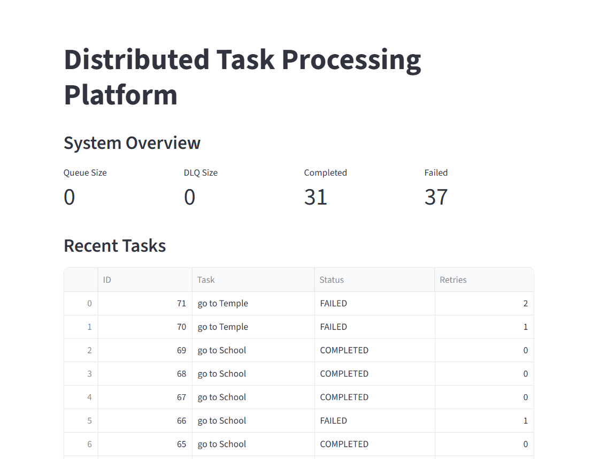

# Distributed Task Processing Platform

A fault-tolerant distributed task processing platform built using FastAPI, PostgreSQL, Redis, Docker, and background workers.

This project simulates how production systems process asynchronous jobs reliably using queues, retries, dead-letter queues, worker locking, crash recovery, and operational monitoring.

---

## Features

### Task Processing Engine

- Create and manage asynchronous tasks
- Background worker execution
- Redis-backed task queue
- PostgreSQL persistence

### Reliability Features

- Retry mechanism for failed tasks
- Dead Letter Queue (DLQ)
- Idempotency protection
- Worker locking using database row locks
- Crash recovery for stuck tasks

### Observability & Operations

- Structured logging
- Prometheus metrics endpoint
- Streamlit operations dashboard
- Queue monitoring
- Task status tracking

### Deployment

- Dockerized services
- Docker Compose orchestration
- Environment-based configuration

---

## Architecture

```text
                +----------------+
                |   Dashboard    |
                |   Streamlit    |
                +--------+-------+
                         |
                         v

+---------+     +--------+-------+
|  Client | --> |    FastAPI     |
+---------+     +--------+-------+
                         |
                         v

                +--------+-------+
                | PostgreSQL DB  |
                +--------+-------+
                         |
                         v

                +--------+-------+
                | Redis Queue    |
                +--------+-------+
                         |
                         v

                +--------+-------+
                | Worker(s)      |
                +--------+-------+
                         |
              +----------+----------+
              | Retry / DLQ /       |
              | Recovery Worker     |
              +---------------------+
```

---

## Tech Stack

### Backend

- FastAPI
- SQLAlchemy
- PostgreSQL

### Queueing

- Redis

### Infrastructure

- Docker
- Docker Compose

### Monitoring

- Prometheus Metrics
- Streamlit Dashboard

---

## Dashboard

The platform includes a live operations dashboard displaying:

- Queue Size
- Dead Letter Queue Size
- Completed Tasks
- Failed Tasks
- Recent Task Activity

Add screenshots inside:

```text
screenshots/
```

Example:

```markdown

```

---

## Running Locally

### Clone Repository

```bash
git clone https://github.com/subham-18/distributed-task-processing-platform.git
cd distributed-task-processing-platform
```

### Start Services

```bash
docker compose up --build
```

### API

```text
http://localhost:8000/docs
```

### Metrics

```text
http://localhost:8000/metrics
```

### Dashboard

```bash
streamlit run dashboard.py
```

---

## Key Concepts Demonstrated

- Distributed Task Processing
- Asynchronous Job Execution
- Retry Strategies
- Dead Letter Queues
- Fault Tolerance
- Worker Locking
- Crash Recovery
- Observability
- Containerization

---

## Future Improvements

- Grafana Dashboards
- JWT Authentication
- Worker Auto Scaling
- Kubernetes Deployment
- Alerting & Monitoring
- Role-Based Access Control

---

## Author

Subham

Backend Engineering | Distributed Systems | High Performance Systems
